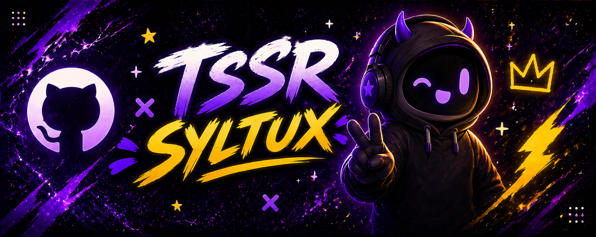
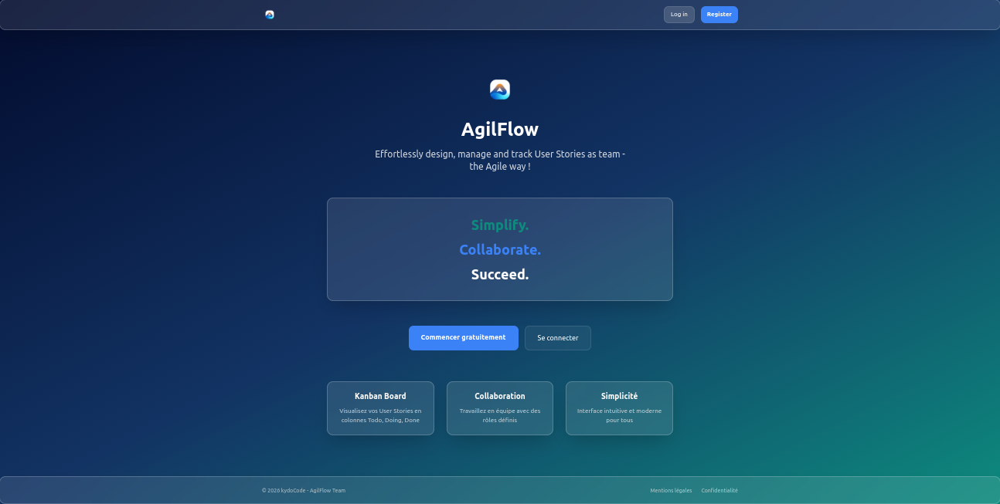
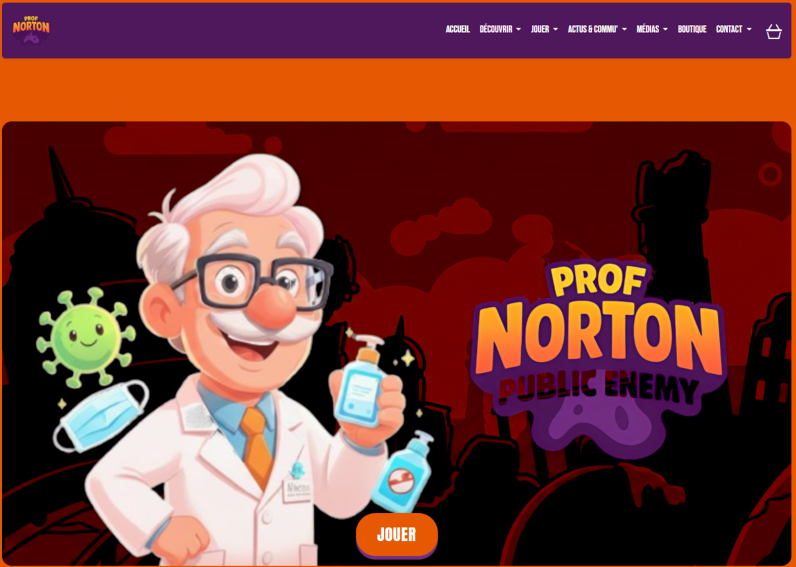
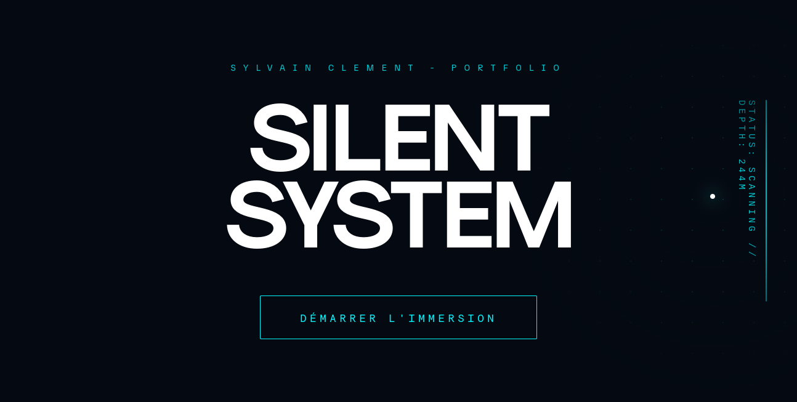

  <a href="README.md">English</a> | <a href="README_fr.md">Français</a> | <a href="README_de.md">Deutsch</a> | <a href="README_zh.md">中文</a>

<h1 align="center">
  
</h1>

<h1 align="center">Syltux</h1>

  
  &nbsp;
  
  
  
  &nbsp;

## About Me
IT systems and networks technician, full-stack developer & UI designer — building secure infrastructures and high-performance web applications from the ground up. 
Junior IT-trained with hands-on experience in network hardening, Windows Server administration, and interactive web development. RNCP-certified web application developer (DAWI).

  

## My Skills

### // IT

### 🌐 Networks & Protocols

  
  
  
  
  
  

  
  

### 🖥️ Systems & Virtualization

  
  
  
  
  
  

  
  
  
  

### 📂 Directory, Services & Web

  
  
  
  
  
  

### 🛡️ Security & Monitoring

  
  
  
  

### 🔌 Remote Access, ITSM & Storage

  
  
  

### // UI/UX Design 

### 🎨 Creative Stack & UI Design

  
  
  
  

  
  

### // Development && QA

### 💻 Programming Languages & Frameworks

  
  
  
  

  
  
  
  
  

### 📦 Content Management Systems (CMS)

  
  

### 🗄️ Databases, QA & Versioning / CI/CD

  
  
  
  
  

  

## Current Focus
* **IT Infrastructure & Security** : Deploying and hardening network services (pfSense, VLANs, OpenVPN/WireGuard, Fail2ban) in lab environments.
* **Windows Server Administration** : Active Directory, GPO, MDT/WDS deployment, WSUS patch management.

  

## Study Projects Gallery

  <a href="https://www.agilflow.app/"><b>AgilFlow 2026</b></a> •
  <a href="https://www.prof-norton.com/"><b>Prof Norton</b></a>  •
  <a href="https://www.sylvainclement.dev/"><b>Portfolio 2026</b></a>

## Featured Projects

  <a href="https://www.agilflow.app/">
    <svg width="400" height="18" viewBox="0 0 400 18" fill="none" xmlns="http://www.w3.org/2000/svg" style="display:block; margin:0 auto;"><rect width="400" height="18" rx="8" fill="#2D333B"/><circle cx="12" cy="9" r="3" fill="#FF5F56"/><circle cx="24" cy="9" r="3" fill="#FFBD2E"/><circle cx="36" cy="9" r="3" fill="#27C93F"/></svg>
  </a>

  <a href="https://www.prof-norton.com/">
    <svg width="400" height="18" viewBox="0 0 400 18" fill="none" xmlns="http://www.w3.org/2000/svg" style="display:block; margin:0 auto;"><rect width="400" height="18" rx="8" fill="#2D333B"/><circle cx="12" cy="9" r="3" fill="#FF5F56"/><circle cx="24" cy="9" r="3" fill="#FFBD2E"/><circle cx="36" cy="9" r="3" fill="#27C93F"/></svg>
  </a>

  <a href="https://www.sylvainclement.dev/">
    <svg width="400" height="18" viewBox="0 0 400 18" fill="none" xmlns="http://www.w3.org/2000/svg" style="display:block; margin:0 auto;"><rect width="400" height="18" rx="8" fill="#2D333B"/><circle cx="12" cy="9" r="3" fill="#FF5F56"/><circle cx="24" cy="9" r="3" fill="#FFBD2E"/><circle cx="36" cy="9" r="3" fill="#27C93F"/></svg>
  </a>

  

## Activity & Impact

  

  

  <!--  -->
  

<i>Don't forget to star interesting projects!</i>

  

## Contact & Links

  <a href="https://www.sylvainclement.dev/" target="_blank"><b>Website / Portfolio</b></a>

  

## Governance & Security
> **Standard 3-2-1:** Professional backup strategy applied (Local, Cold, Cloud).  
> **Authority:** All commits are **GPG-signed** to ensure code integrity and authenticity.

  

